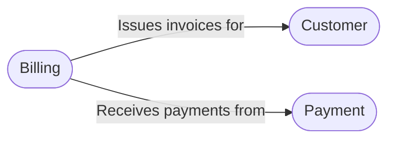

# Bounded Contexts

We’ll start with a single context and expand as the system grows.

## Billing Context

**Responsibility:**
- Managing invoices and their lifecycle (draft, issued, paid)  
- Handling line items and calculating totals  

**Key Aggregates & Value Objects:**
- **Invoice** (root)  
- **LineItem** (entity)  
- **Money** (value object)  

**Collaborations:**
- **Customer Context:** retrieves customer details (name, address)  
- **Payment Context:** records and applies payments against invoices  

### Context Map

